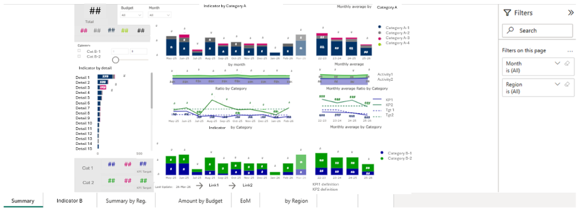
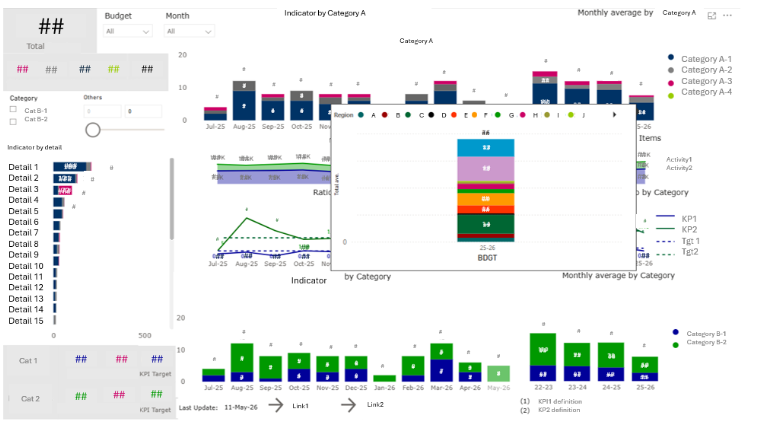
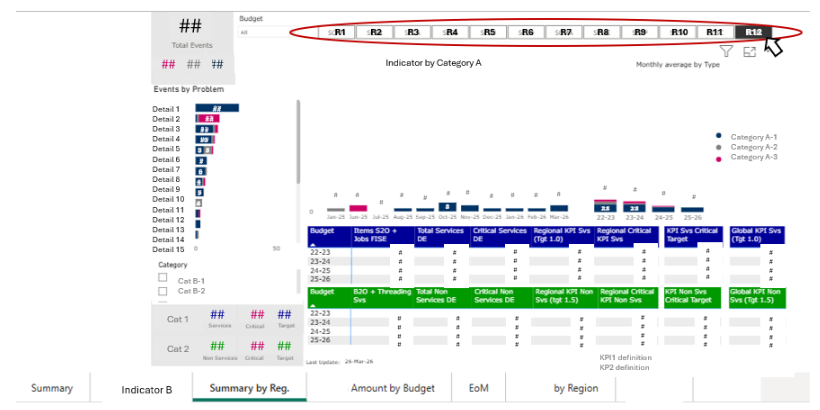

# 📊 Power BI Management Dashboard | Data Analytics & KPI Visualization

## 🚀 Overview
This project showcases an **end-to-end Power BI dashboard** designed for **business performance monitoring**, **KPI tracking**, and **data-driven decision-making**.  

The solution enables stakeholders to interact with data, explore trends, and analyze performance metrics through **interactive reporting**, **data visualization**, and **business intelligence (BI)** tools.

---

## 🎯 Business Context
In modern organizations, decision-making relies heavily on accurate and timely data insights.  

This dashboard was developed to:
- Monitor **key performance indicators (KPIs)**
- Enable **performance tracking vs budget**
- Provide **executive-level reporting**
- Support **strategic decision-making**

---

## ⚠️ Data Disclaimer
Due to **confidentiality constraints**, the dataset is not included.  
The project focuses on:
- Dashboard design
- Data modeling logic
- KPI visualization
- Business interpretation of insights

---

## 📊 Dashboard Overview

### 🔹 Summary Page (Executive View)
High-level overview of the two main KPIs, consolidating critical metrics for executive reporting.

---

### 🔹 Custom Tooltips (Advanced Insights)
Enhanced user interaction through **custom tooltips**, including:
- Additional contextual insights
- Geographical breakdowns by region

---

### 🔹 Regional Performance Analysis
Detailed regional performance visualization with:
- Filtering by month
- Budget year comparison
- Drill-down capabilities

---

## 📈 Key Features
- **Interactive dashboards** with dynamic filters (date, period, category)
- **KPI Cards** for executive-level monitoring
- **Time-series analysis** (line & area charts)
- **Drill-down capabilities** for detailed exploration
- **Custom tooltips** for enhanced user insights
- **Bookmarks & navigation** for improved UX
- **Horizontal bar charts** for detailed breakdown of indicators
- **Budget vs actual analysis**
- **Dynamic segmentation** for user-driven analysis

---

## 📊 Analysis & Methodology
The dashboard was built following a structured **data analytics workflow**:

1. Data preparation and transformation  
2. KPI definition and metric calculation  
3. Data modeling for performance tracking  
4. Visualization design using Power BI  
5. User experience optimization  

---

## 📉 Key Insights
- Identification of trends across the last 10 months  
- Visibility of KPI evolution vs budget targets  
- Detailed performance breakdown by region  
- Correlation between activity levels and KPI results  

---

## 🛠️ Tools & Technologies
- **Power BI**
- **Data Visualization**
- **Business Intelligence (BI)**
- **KPI Tracking**
- **Dashboard Development**
- **Data Analysis**
- **Performance Monitoring**

---

## 💼 Business Impact
- Improved **decision-making process**
- Enhanced **performance visibility**
- Reduction in manual reporting efforts
- Enablement of **self-service analytics**
- Better understanding of **regional performance drivers**

---

## 📂 Repository Structure
project/
│
├── README.md
├── images/
│   ├── summary.png
│   ├── tooltips.png
│   ├── regional.png

---

## 🔮 Future Improvements
- Integration with real-time data sources  
- Advanced predictive analytics models  
- Automation of data refresh pipelines  
- Expansion of KPIs and business metrics  

---

## 📌 Key Skills Demonstrated
- **Data Analytics**
- **Power BI Dashboard Development**
- **Data Visualization**
- **Business Intelligence**
- **KPI Monitoring & Reporting**
- **Interactive Reporting**
- **Data Storytelling**
- **Performance Analysis**

---

## 📄 Notes
This project focuses on demonstrating **real-world data analytics capabilities** and **business-oriented insights**, aligned with industry standards for **Data Analyst** and **Business Intelligence roles**.
